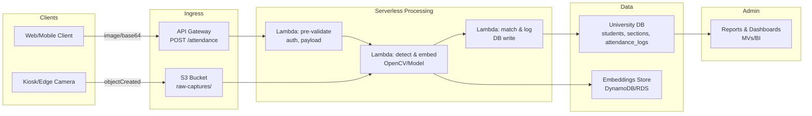
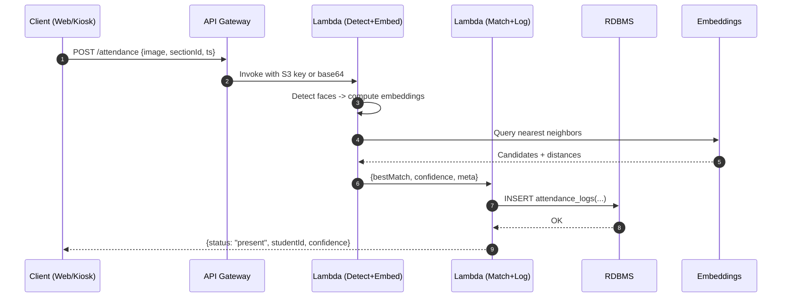

# 👤📷 Face Recognition–Based Attendance System

> **Note:** This repository contains **partial code**. This README documents the **full system** (architecture, data flow, design decisions) and includes **pseudocode** to make the complete implementation clear.

---

<p align="center">
  <a href="#overview">Overview</a> •
  <a href="#features">Features</a> •
  <a href="#architecture">Architecture</a> •
  <a href="#model--pipeline">Model & Pipeline</a> •
  <a href="#api-surface">API</a> •
  <a href="#roadmap">Roadmap</a>
</p>

---

## Overview

A **serverless attendance system** that uses **OpenCV** for face detection/recognition and **AWS Lambda** for scalable, low-ops processing. It integrates with the **university database** for roster sync and writes verified events to an attendance log. In pilots, automated logging helped **reduce attendance errors by ~40%**.

**Core stack**
- **CV/ML:** OpenCV (+ embeddings / classical baselines), NumPy
- **Serverless:** AWS Lambda (+ API Gateway / S3 triggers)
- **Storage:** S3 (images), Relational DB (e.g., PostgreSQL/MySQL) for roster & logs
- **Optional:** DynamoDB for embeddings cache, SNS/Email for exception alerts
- **Analytics:** Materialized rollups for daily/weekly attendance summaries

---

## Features

- **One-click capture** from web/mobile client or **auto-ingest** from a kiosk camera
- **Face detection & recognition** with configurable thresholds and liveness checks (optional)
- **Roster validation** and duplicate suppression (e.g., repeated scans within a time window)
- **Audit trail** with original image key, recognized ID, confidence, and operator/device metadata
- **Admin dashboards**: daily/weekly presence, late arrivals, exceptions queue
- **Privacy controls**: redaction of stored images, data retention windows

---

## Architecture

### 1) System Map (High-Level)



### 2) Capture → Recognition → Log (Sequence)



---

## Model & Pipeline

Two reference approaches (choose per constraints):

1) **Embeddings-based** (recommended)
   - Detector: OpenCV DNN or HaarCascade → aligned face crops
   - Embeddings: Lightweight backbone (e.g., MobileFace / FaceNet-style) → vector
   - Matching: cosine similarity / L2 to enrolled vectors (top-k + threshold)

2) **Classical baseline**
   - Detector: HaarCascade / HOG + SVM
   - Recognizer: LBPHFaceRecognizer (OpenCV) per class
   - Simpler, but less robust across lighting/pose

**Lambda pseudocode (Python)**

```python
# lambda_detect_embed.py (pseudocode)
def handler(event, context):
    img = load_image(event)  # from base64 or S3
    faces = detect_faces(img)  # OpenCV cascade/DNN
    results = []
    for face in faces:
        crop = align_crop(img, face)
        emb = embed(crop)     # model.forward(crop)
        results.append({"bbox": face, "embedding": emb})
    return {"results": results, "requestId": event["requestId"]}
```

```python
# lambda_match_log.py (pseudocode)
def handler(event, context):
    candidates = []
    for r in event["results"]:
        hits = query_nearest_neighbors(r["embedding"])  # EMB store
        best = select_best(hits, threshold=TH)
        if not best:
            candidates.append({"status": "unknown"})
            continue
        # dedupe within session window
        if recently_marked(best.student_id, event["sectionId"]): 
            continue
        log_attendance(best.student_id, event["sectionId"], event["ts"], event["requestId"])
        candidates.append({"studentId": best.student_id, "confidence": best.score})
    return {"candidates": candidates}
```

**Thresholding & quality checks**
- Reject small/blurred faces via area/sharpness heuristic
- Optional liveness (blink/motion challenge) for kiosk mode
- Adaptive threshold per section/camera (calibrated from validation set)

**Batch utilities**
- Enrollment scripts to compute and persist embeddings for the roster
- Periodic re-enrollment when new students join or images update

---

## API Surface

```http
# Upload a capture for recognition
POST /attendance
Content-Type: application/json
{
  "image": "<base64 or s3://bucket/key>",
  "sectionId": "CS101",
  "ts": "2025-08-10T09:05:00Z",
  "source": "web"
}

# Admin: mark override (e.g., manual correction)
POST /admin/override
{
  "studentId": "s123",
  "sectionId": "CS101",
  "capturedAt": "2025-08-10T09:05:00Z",
  "reason": "Instructor manual add"
}

# Reports
GET /admin/attendance?sectionId=CS101&range=7d
```

**Notes**
- JWT auth with role-based access (student/instructor/admin)
- Rate limiting + request size limits
- All writes include a `requestId` for traceability

---

## Roadmap

- Lightweight **liveness detection** (blink/motion) for kiosk modes
- **On-device** embedding at the edge to cut latency & cost
- Face **re-enrollment workflow** with quality scoring
- Instructor mobile app for **bulk attendance sweeps**
- Real-time notifications for exceptions (SNS/Email)

---

## License

**Mixed / proprietary** 
Parts of the implementation and datasets are **not public** due to confidentiality. This README serves as a **technical overview** of the complete system.
